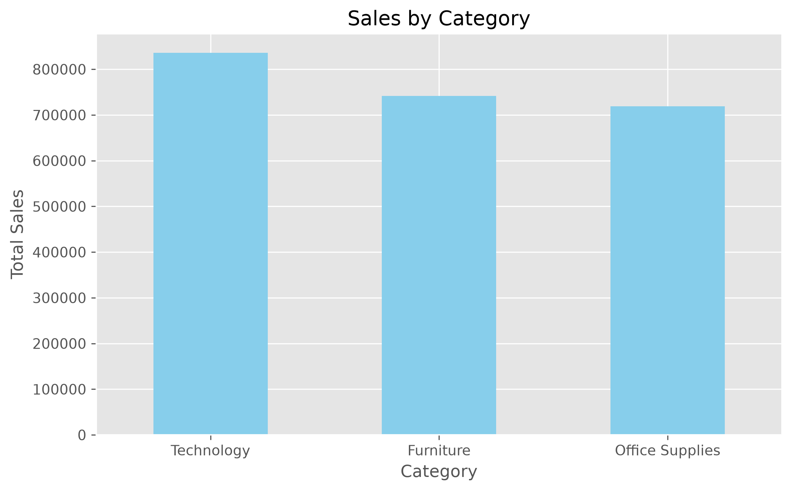
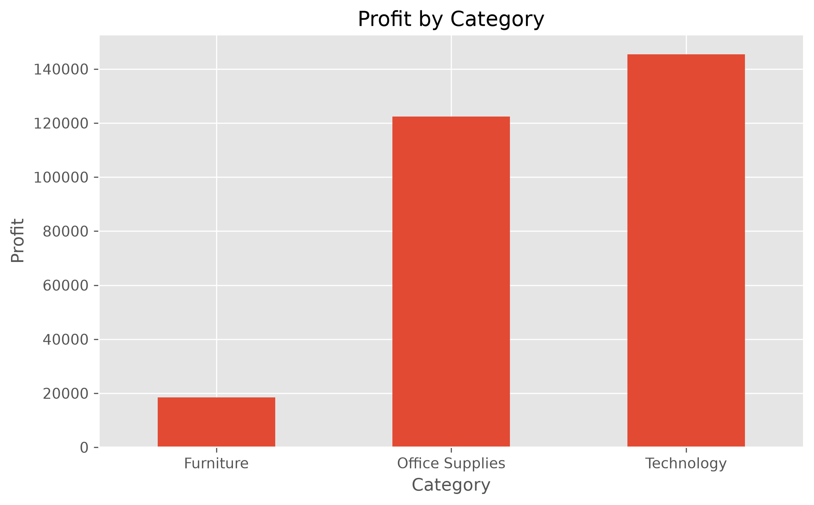
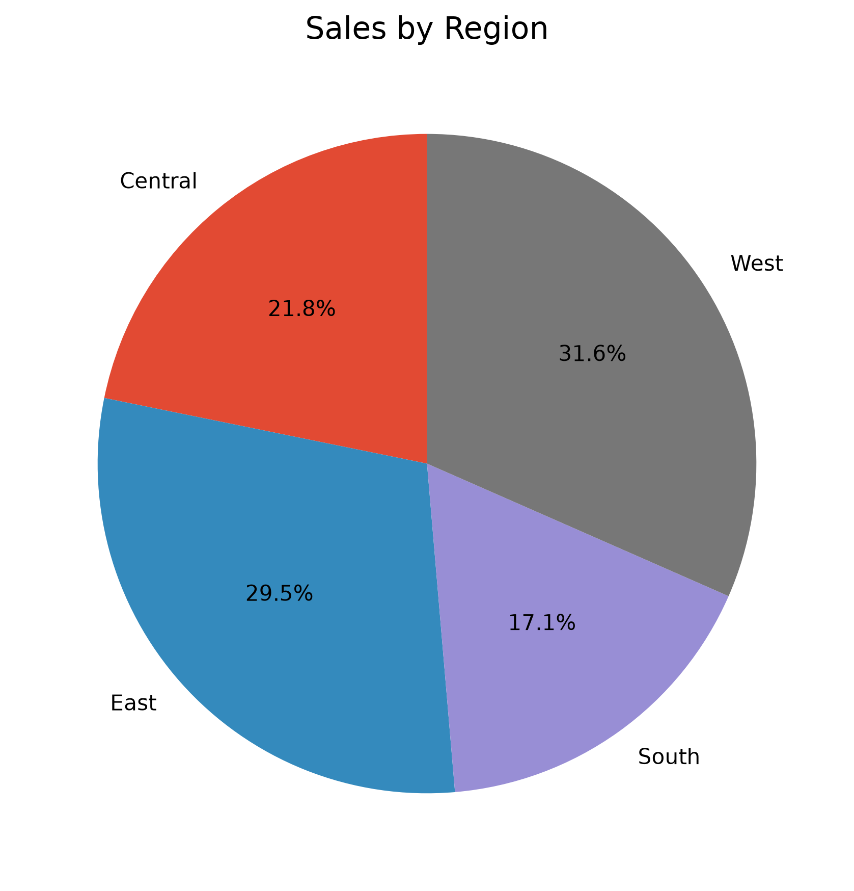
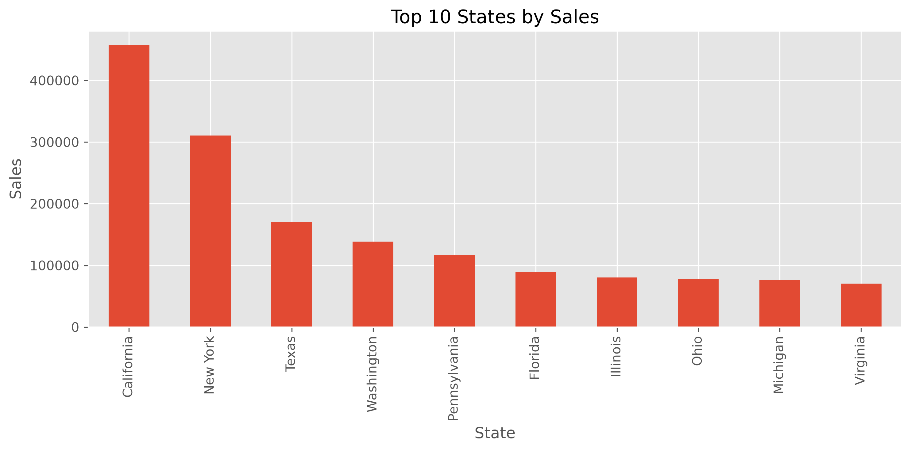
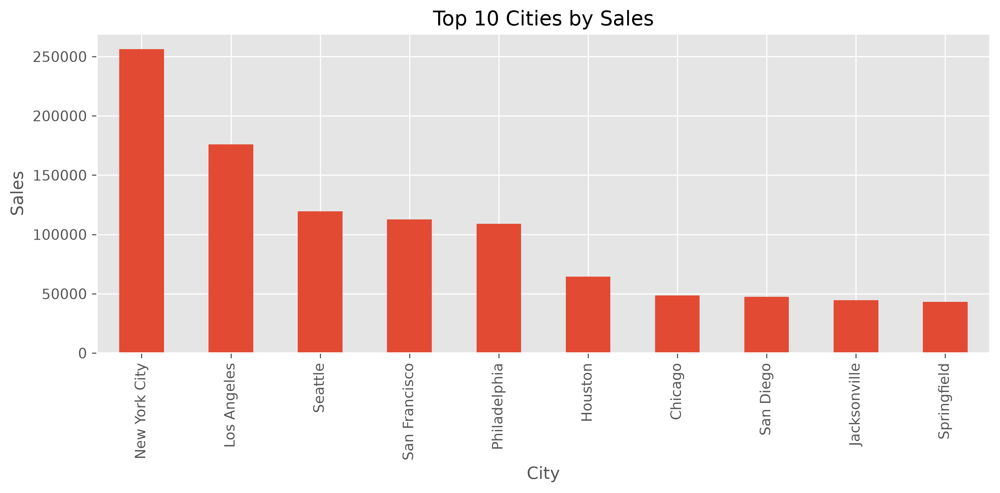
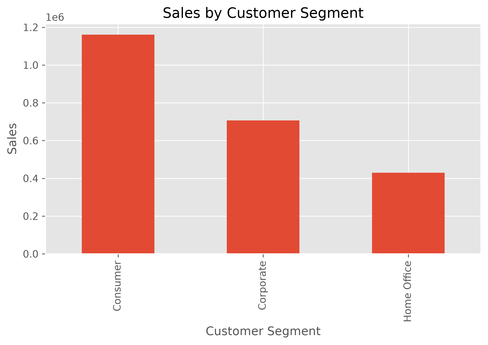
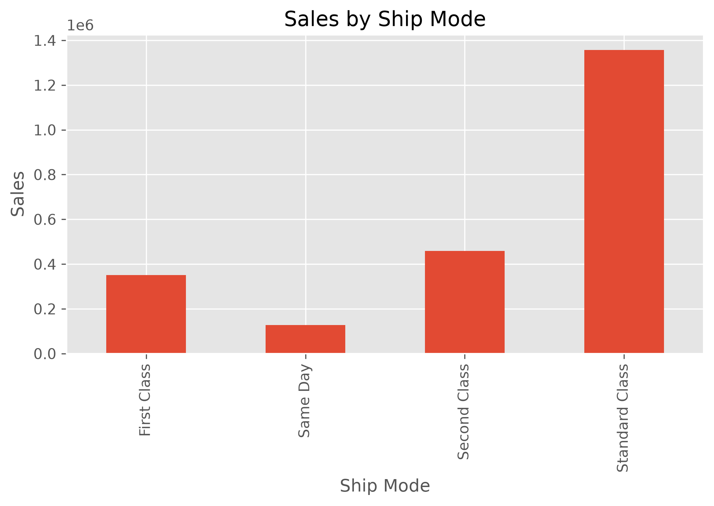
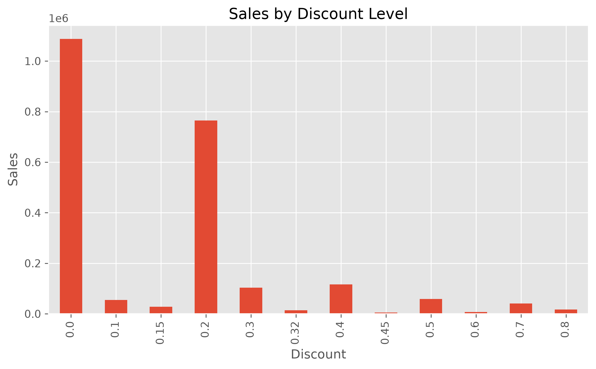
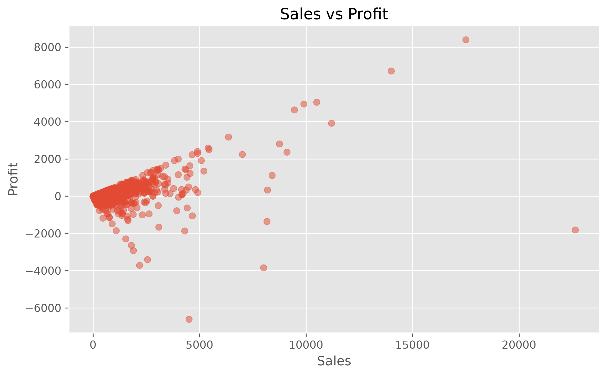

# 📊 Retail Sales Analytics

## Overview

This project performs Exploratory Data Analysis (EDA) on retail sales data to identify sales trends, profitability patterns, customer behavior, regional performance, and the impact of discounts on business outcomes.

The analysis uses Python-based data analytics techniques to transform raw sales data into meaningful visual insights that can support data-driven decision-making.

---

## 🎯 Objective

The objective of this project is to analyze retail sales data and discover:

- Best-performing product categories
- Most profitable categories and regions
- Customer segment performance
- Regional sales trends
- Impact of discounts on profitability
- Relationship between sales and profit

---

## 🛠️ Technologies Used

- Python
- Pandas
- NumPy
- Matplotlib
- Jupyter Notebook

---

## 📂 Dataset

**Dataset Name:** Sample Superstore Dataset

The dataset contains retail transaction details including:

- Order information
- Customer details
- Product categories
- Sales values
- Profit values
- Discounts
- Regions
- Shipping modes

---

# 🔄 Project Workflow

## 1. Data Loading

- Imported the retail sales dataset using Pandas.
- Loaded data into a DataFrame for analysis.

## 2. Data Cleaning

Performed data preprocessing:

- Checked missing values
- Removed duplicate records
- Verified data types
- Prepared data for analysis

## 3. Exploratory Data Analysis (EDA)

Analyzed:

- Category-wise sales
- Category-wise profit
- Regional performance
- Customer segments
- Shipping modes
- Discount impact

## 4. Data Visualization

Created charts to understand business trends and patterns.

---
# 📈 Visualizations

## Sales by Category




## Profit by Category




## Sales by Region




## Top 10 States by Sales




## Top 10 Cities by Sales




## Sales by Customer Segment




## Sales by Ship Mode




## Discount Analysis




## Sales vs Profit



# 📌 Key Insights

- Identified the highest revenue-generating product categories.
- Analyzed profit contribution across different categories.
- Compared sales performance across different regions.
- Identified top-performing states and cities.
- Studied customer segments contributing maximum sales.
- Evaluated the relationship between discounts and profitability.
- Observed patterns between sales volume and profit generation.

---

# 📁 Project Structure

```
Retail-Sales-Analytics/
│
├── data/
│   └── sales_dataset.csv
│
├── notebook/
│   └── retail_sales_analysis.ipynb
│
├── charts/
│   ├── sales_by_category.png
│   ├── profit_by_category.png
│   ├── sales_by_region.png
│   ├── top_states.png
│   ├── top_cities.png
│   ├── ship_mode.png
│   ├── customer_segment.png
│   ├── discount_analysis.png
│   └── sales_vs_profit.png
│
├── requirements.txt
│
└── README.md
```

---

# ⚙️ Installation & Usage

### Clone Repository

```bash
git clone <your-github-repository-link>
```

### Install Required Libraries

```bash
pip install -r requirements.txt
```

### Run Notebook

Open the Jupyter Notebook:

```bash
jupyter notebook
```

Run all cells to reproduce the analysis and visualizations.

---

# 📦 Requirements

```
pandas
numpy
matplotlib
jupyter
```

---

# 🚀 Future Improvements

- Build an interactive dashboard using Power BI or Tableau.
- Add predictive sales forecasting using Machine Learning.
- Implement customer segmentation models.
- Deploy the analytics dashboard as a web application.

---

# 👩‍💻 Author

**Mounika Majeti**

Computer Science Engineering Student

---

⭐ If you found this project useful, consider giving it a star on GitHub.
