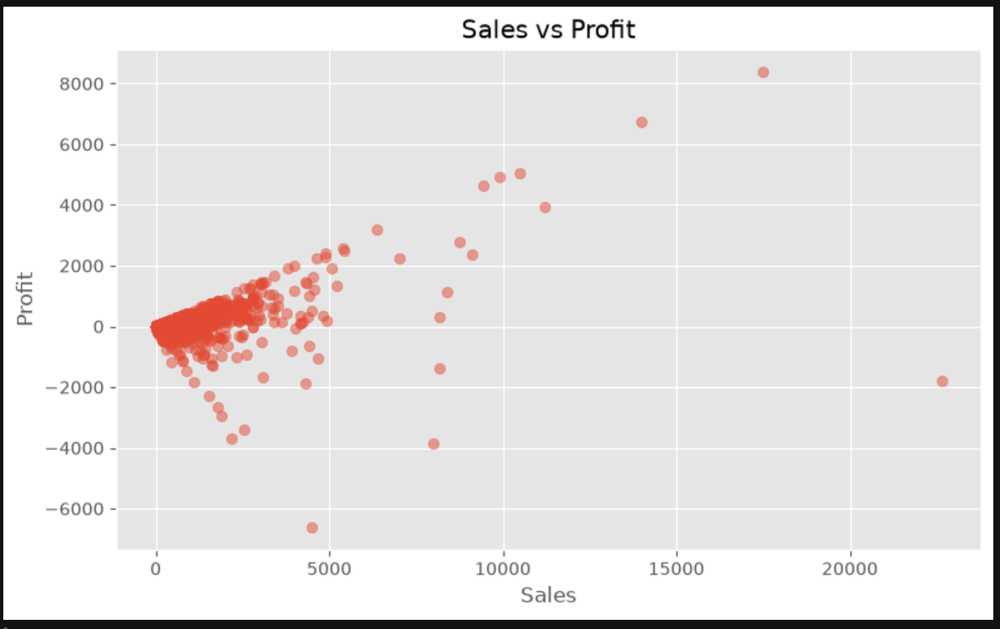

# 📊 Retail Sales Analytics


## Overview

This project analyzes retail sales data to uncover business insights related to sales performance, profitability, customer segments, regional trends, and discount strategies.

Using Python-based data analytics techniques, the project cleans raw transactional data, performs Exploratory Data Analysis (EDA), and creates visualizations to support data-driven decision-making.

---

## 🎯 Objective

The objective of this project is to analyze retail sales data and discover:

- Best-performing product categories
- Most profitable categories and regions
- Customer segment performance
- Regional sales trends
- Impact of discounts on profitability
- Relationship between sales and profit

---

## 🛠️ Technologies Used

- Python
- Pandas
- NumPy
- Matplotlib
- Jupyter Notebook

---

## 📂 Dataset

**Dataset Name:** Sample Superstore Dataset

**Dataset Source:** Kaggle - Sample Superstore Dataset

The dataset contains retail transaction details including:

- Order information
- Customer details
- Product categories
- Sales values
- Profit values
- Discounts
- Regions
- Shipping modes

---

# 🔄 Project Workflow

## 1. Data Loading

- Imported the retail sales dataset using Pandas.
- Loaded data into a DataFrame for analysis.

## 2. Data Cleaning

Performed data preprocessing:

- Checked missing values
- Removed duplicate records
- Verified data types
- Prepared data for analysis

## 3. Exploratory Data Analysis (EDA)

Analyzed:

- Category-wise sales
- Category-wise profit
- Regional performance
- Customer segments
- Shipping modes
- Discount impact

## 4. Data Visualization

Created charts to understand business trends and patterns.


# 📈 Visualizations

## Sales by Category


## Profit by Category


## Sales by Region


## Top 10 States by Sales


## Top 10 Cities by Sales


## Sales by Customer Segment


## Sales by Ship Mode


## Discount Analysis


## Sales vs Profit


# 📸 Project Preview



# 📌 Key Insights

- Identified the highest revenue-generating product categories from retail transactions.
- Analyzed category-wise profit contribution and profitability patterns.
- Compared regional sales performance and identified top-performing regions.
- Identified customer segments contributing maximum sales revenue.
- Analyzed the effect of discounts on profit generation.
- Observed the relationship between sales volume and profit performance.
---

# 📁 Project Structure

```
Retail-Sales-Analytics/
│
├── data/
│   └── sales_dataset.csv
│
├── notebook/
│   └── retail_sales_analysis.ipynb
│
├── charts/
│   ├── sales_by_category.png
│   ├── profit_by_category.png
│   ├── sales_by_region.png
│   ├── top_states.png
│   ├── top_cities.png
│   ├── ship_mode.png
│   ├── customer_segment.png
│   ├── discount_analysis.png
│   └── sales_vs_profit.png
│
├── requirements.txt
│
└── README.md
```

---

# ⚙️ Installation & Usage

### Clone Repository

```bash
git clone <your-github-repository-link>
```

### Install Required Libraries

```bash
pip install -r requirements.txt
```

### Run Notebook

Open the Jupyter Notebook:

```bash
jupyter notebook
```

Run all cells to reproduce the analysis and visualizations.

---

# 📦 Requirements

```
pandas
numpy
matplotlib
jupyter
```

---

# 📌 Project Status

Completed:

- Data cleaning and preprocessing
- Exploratory Data Analysis
- Data visualization
- Business insights generation
- GitHub documentation

Future enhancements:

- Interactive dashboard development
- Machine Learning-based sales forecasting
- Web application deployment

# 🚀 Future Improvements

- Build an interactive dashboard using Power BI or Tableau.
- Add predictive sales forecasting using Machine Learning.
- Implement customer segmentation models.
- Deploy the analytics dashboard as a web application.

---

# 👩‍💻 Author

**Mounika Majeti**

Computer Science Engineering Student

---

⭐ If you found this project useful, consider giving it a star on GitHub.

---

# 📄 License

This project is created for educational and portfolio purposes.